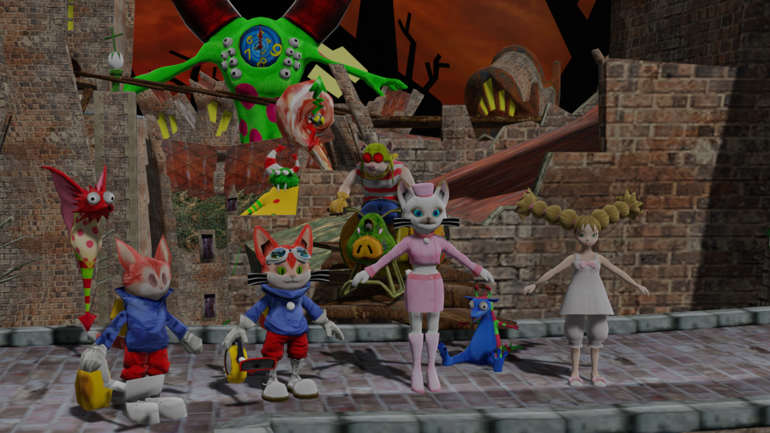

# Rewind
Rewind is a Python script used for extracting models, both characters and geometry, from `Blinx: The Time Sweeper`.



## Prerequisites
 - Python (>= 3.8)
 - pillow (https://pillow.readthedocs.io/en/latest/installation.html#basic-installation)
 - gltflib (https://pypi.org/project/gltflib/)
 - Any copy of `Blinx: The Time Sweeper`

## Notes
`Blinx: The Time Sweeper` packs all its model data into the game's executable and most the addresses for this model data is not available as an easy to parse format, instead being referenced mostly in code. You can use something like [Ghidra](https://ghidra-sre.org/) and [ghidra-xbe](https://github.com/XboxDev/ghidra-xbe) to decompile the game and manually locate model data, or you can use `brute_force_extract.py` to search for model data and automatically extract it, see usage below.

## Usage
Before anything is run, you'll need to obtain a copy of `Blinx: The Time Sweeper` and have the files extracted so you're able to access `default.xbe` and `media/`. You can use [extract-xiso](https://github.com/XboxDev/extract-xiso) to extract the game files if you've ripped or in other ways obtained the game as a xiso/iso file.

When you run `rewind.py` you'll need to supply the executable (`default.xbe`) and the texture directory (`media/`) along with the starting node's virtual address and texture string table virtual address. If you don't know how to find these addresses you can instead run `brute_force_extract.py` which will try and automatically find every starting node for the specified executable and extract them.

#### Example usage of `rewind.py`
```
python3 rewind.py "path/to/default.xbe" -t "path/to/media/" -n 0x01234567 -s 0x89012345 -b "an_object" -f "glb" -o "path/to/output_folder/"
```
Above example will try and read model data starting at a node from virtual address `0x01234567` with a texture string table located at virtual address `0x89012345`. Textures will be searched for in the `path/to/media/` folder and, if all goes well, it will finally extract a model of format `glb` to `path/to/output_folder/` which will have a file name of `an_object.glb`. You can find out more information about each argument by running `python3 rewind.py --help`.

#### Example usage of `brute_force_extract.py`
```
python3 brute_force_extract.py "path/to/default.xbe" -t "path/to/media/" -f "glb" -o "path/to/output_folder/"
```
Mostly the same arguments as above except that we don't specify a node or string table address as these will be found during the brute-forcing process.

## TODOs
 - [ ] Support outputting as OBJ files
 - [ ] Add support for `Blinx 2: Masters of Time and Space`, which has very similar data layout

## Thanks to
Big thanks to bakerdonkey who created [pyBlinx](https://github.com/bakerdonkey/pyBlinx) and was hugely helpful back when I had lots of questions about this model format and all of the model data seemed very daunting.